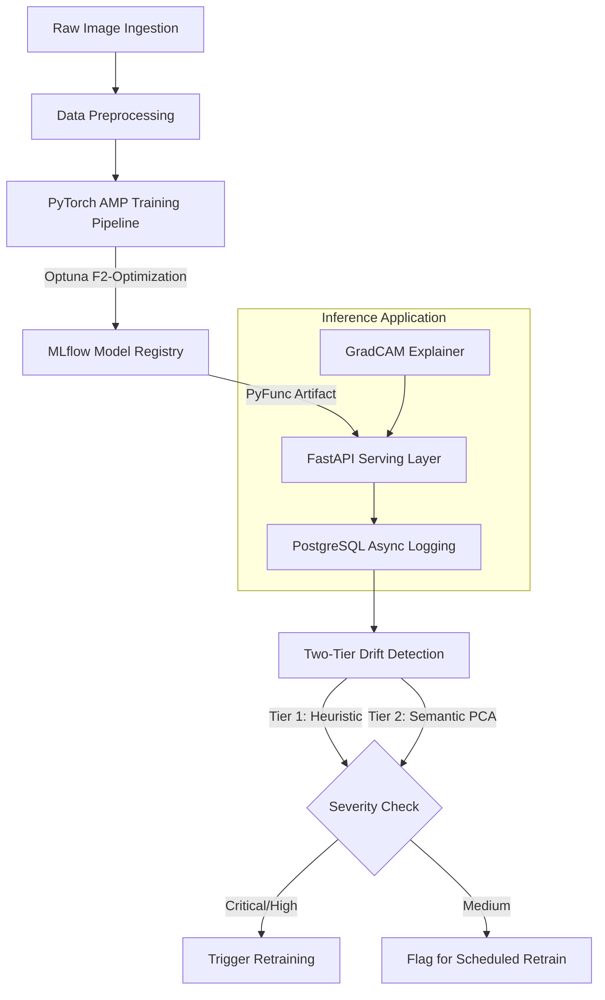

# 🏭 Casting Defect Detection: VisionOps Pipeline

This repository contains a production-ready, end-to-end Machine Learning system for real-time industrial defect detection. It transitions a standard Computer Vision classification task into a highly observable, stateless, and mathematically rigorous MLOps architecture.

## 📐 System Architecture Flow



## 🏗️ Core System Components

### 1. Data Collection & Preprocessing

* **Asynchronous Telemetry:** Inference logs and images are written to a PostgreSQL database (`asyncpg`) without blocking the 50ms API response time, establishing a continuous, zero-latency feedback loop.
* **Deterministic Augmentation:** Implements strict `torchvision.transforms` (224x224 resize, ImageNet normalization) during both training and inference. Aggressive augmentations (Gaussian blur, color jitter, random erasing) are applied exclusively during training to simulate harsh factory lighting and sensor variations.

### 2. Model Implementation & Versioning

* **Architecture:** Fine-tuned transfer learning backbone (EfficientNet-B3 / ResNet50).
* **Hardware Optimization:** Utilizes Automatic Mixed Precision (AMP) to halve the GPU memory footprint and double training throughput.
* **F2-Score Optimization:** Evaluated explicitly on the **F2-Score** to heavily penalize False Negatives (missing a defective part), aligning with industrial QA risk profiles. Mathematical threshold optimization is calculated dynamically, replacing the naive `0.5` binary cutoff.
* **Registry:** Managed via MLflow/DagsHub. Models are packaged as `mlflow.pyfunc` artifacts, ensuring deployment environments remain entirely decoupled from training environments.

### 3. Inference & Deployment Strategy

* **Serving Layer:** FastAPI application designed for stateless, containerized deployment (e.g., AWS Fargate).
* **Human-In-The-Loop (HITL):** Predictions falling within the `[0.35, 0.65]` probability band are flagged with `requires_review: True`, automatically routing borderline cases to a human QA engineer rather than forcing a blind binary decision.
* **Explainability:** An isolated `/explain` endpoint generates GradCAM heatmaps to visually justify defect classifications to factory stakeholders.

### 4. Monitoring & Reliability (Two-Tier Drift Detection)

Traditional drift monitoring (averaging raw embeddings) collapses multidimensional variance and fails on multimodal manifolds. This system implements a mathematically sound dual-tier approach:

* **Tier 1 (Heuristic):** Extracts tabular image statistics (brightness, contrast, aspect ratio) and runs KS-Tests and Population Stability Index (PSI) via Evidently AI. *Purpose: Instantly detect hardware failures, dirty lenses, or lighting degradation.*
* **Tier 2 (Semantic):** Passes images through a headless ResNet50, applies PCA to retain 95% of the variance, and runs KS/PSI tests on the principal components. *Purpose: Detect new defect morphologies that leave pixel statistics unchanged.*

---

## ⚖️ Decisions, Tradeoffs, Assumptions & Limitations

### Decisions & Tradeoffs

* **Compute vs. Real-Time Drift:** Tier-2 semantic drift detection uses a batched ResNet50 extractor. To control cloud compute costs, the sample size is capped at 300 images per run, trading exhaustive statistical precision for financial sustainability in a scheduled job.
* **Stateless Logs vs. S3 Batches:** To ensure compatibility with ephemeral, serverless containers (like AWS Fargate), all local file-writing and background S3 sync loops were removed in favor of asynchronous PostgreSQL inserts. The container can spin down at any moment without data loss.

### Assumptions

* **Affine Stability:** Industrial cameras maintain a relatively static orientation over conveyor belts; therefore, massive affine transformations (like extreme zooming or shearing) were intentionally excluded from the augmentation pipeline to prevent underfitting.

### Limitations

* **GradCAM Latency Overhead:** Generating gradient-based explanations adds ~100-200ms of latency per image. Therefore, explainability is isolated to its own `/explain` endpoint and is excluded from the high-throughput `/predict/batch` endpoint.

---

## 🚀 Setup and Usage

### Prerequisites

* Python 3.12+
* Docker
* DVC (for pulling data)
* MLflow / DagsHub credentials

### Installation

```bash
# Clone repository
git clone <repo-url>
cd vision-ops-pipeline

# Install dependencies
pip install -r requirements.txt

# Pull Kaggle Dataset via DVC
dvc pull

# Configure environment
cp .env.example .env

```

### Execution

**1. Run the Training & Promotion Pipeline**

```bash
python mlops/orchestrator.py --force-retrain --trials 10

```

**2. Start the Inference API**

```bash
uvicorn api_service.api:app --host 0.0.0.0 --port 8000

```

**3. Test a Prediction**

```python
import requests

files = {'file': open('sample_defect.jpg', 'rb')}
response = requests.post('http://localhost:8000/predict', files=files)

print(response.json())
# Expected Output: {"prediction": 1, "confidence": 0.89, "requires_review": False, ...}

```

### Demo: quick local model and smoke tests

To make it easy to validate the repo without large datasets or heavy training, a tiny demo training script creates a synthetic dataset, trains a small ResNet50 for 2 epochs, and saves a demo checkpoint used by the API.

Run the demo training (creates `artifacts/efficientnet_b3_model.pth` and threshold file):

```bash
python examples/demo_train.py
```

Run the pytest smoke tests (they will run the demo training if artifacts are missing):

```bash
pytest -q
```

This yields a minimal end-to-end validation: a demo model, API health and model-info checks, and example inference.

---

## Next steps and recommended improvements

- Add small sample images under `data/test/` for integration tests that validate `/predict` and `/predict/batch` outputs.
- Wire a lightweight GitHub Actions workflow that runs `examples/demo_train.py` and the pytest smoke tests on PRs.
- Configure MLflow remote tracking and a simple script to promote models from the registry into the `artifacts/` folder for production readiness.

```